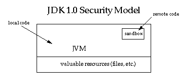
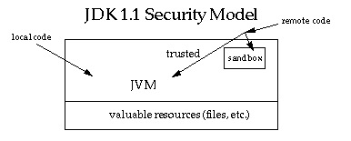
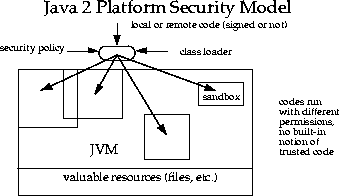

#
Java安全模型演进

------

# 0x01 前言 
对于一门语言，安全需求往往很难从一开始就被高屋建瓴。尽管Java在很早就将安全纳入设计，但是免不了经历探索，Java的安全模型大致经历了几个版本演进才基本稳定下来。

# 0x02 最初模型（v1.0）
最初的模型其实就是一个沙盒模型，模型很简单。如下图所示：

模型将本地代码和远程代码区别对待：本地代码信任，具备充分权限访问系统受保护资源（如文件系统）；远程代码不信任，需要严格控制在沙盒中执行，所具备的权限由沙盒控制。
这个模型跟早期Java发展息息相关，上一篇历史讲述了Java起家是乘着浏览器盛起之风，Java一次编写能够到处运行除了跨平台，还需要借助互联网传播。从远端下载的远程代码（主要是applet）是无法保证不包含恶意代码。
沙盒模型是在JDK1.0被采用。

# 0x03 增加代码数字签名（v1.1）
1.0模型对于远程代码的限制对于有些场景未免过于死板，比如同一个公司不同开放团队希望复用，一个团队从网络下载另一个团队的代码则会出现互不信任。
所以在1.1模型中增加了数字签名，如果签名的数字整数是被接收端信任的，则远程下载的代码跟本地代码一样被认为是可信任的，具备充分权限。模型如下图所示：

该模型在JDK1.1加入。

# 0x04 精细化（v2.0）
在JDK1.2中模型取得了极大的进化，如下图所示：

在这个模型里，摒弃了前面的本地代码远程代码信任的切分，全部都需要在沙盒中。
相比前面的模型，这个模型：
> * 访问控制精细化
> * 访问控制更加容易扩展
> * 安全策略容易配置
> * 安全检查不仅限applet，其他应用也被检查

# 0x05 参考
https://docs.oracle.com/javase/7/docs/technotes/guides/security/spec/security-spec.doc1.html